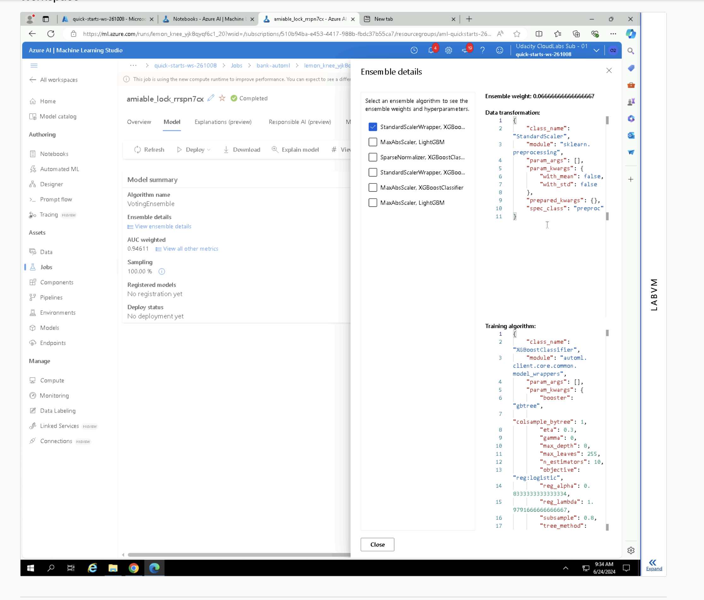

BankMarketing using Azure Machine learning studio
In this project of of the course "Machine Learning Engineer with Microsoft Azure", we leverage Microsoft Azure Machine Learning Studio to create a model based on a dataset, deploy it to a web service, consume the endpoints to get the results back and also automated the flow using pipelines.

** Overview of the project.

Initially, the dataset - BankMarketing dataset - was recorded. Subsequently, the dataset underwent an AutoML step. The finest model from the AutoML operation, identified as the Voting Ensemble with an accuracy of 94.673%, was recorded. This model was dispatched to a webservice using Azure Container Instance. We activated logging and also enabled application insights. Swagger was utilized to access the deployed model, while the endpoint.py script facilitated interaction with the trained model where we are feeding data into model and getting the output. The forthcoming strategy involves creating an Azure ML Pipeline via Python SDK to achieve streamlined automation and enhance efficiency.

The key objective of the model is to determine if the potential customer will join the subscription - yes or no.

## Architectural Diagram
**: Provide an architectual diagram of the project and give an introduction of each step. 

## Key Steps
**: Write a short discription of the key steps. Remeber to include all the screencasts required to demonstrate key steps. 

1) Create a dataset in azureml and load data in tabular form-

2) Run the Automl experiment using binary classification-

3) Final status of Auto Ml experiment-

4) Best model given by automl-

5) See the parameters of the best Model - VotingEnsemble with accuracy of 94.61%

6) Deploying a machine learning model using Azure Container Instance (ACI) enables the establishment of a scalable, serverless environment, facilitating interaction with the model through HTTP POST requests once the endpoint is provisioned (Currently - application insights enabled is false).

7) Using python script to enable application insights 

8) Application insights enabled has become true  after running the logs.py script

9) View logs: Enabling Application Insights logging allows for the monitoring of performance and the diagnosis of issues related to your deployed model.

10) Deploy Swagger to your local machine using a Docker image, and utilize the swagger.json file from our model deployment to access documentation detailing the endpoints. Consume the endpoint giving 2 inputs and see the result.

11) Pipeline setup and execution: Achieve full automation by generating an Azure ML Pipeline using the Python SDK. Automation and Efficiency - Pipelines streamline the progression of machine learning tasks, encompassing data preprocessing, model training, and evaluation. Detailed instructions can be found in the 'aml-pipelines-with-automated-machine-learning-step.ipynb' Jupyter notebook.

Results of 2 data inputs-

12) Trigger pipeline from notebook

12) Pipeline REST endpoint: You can view the REST endpoint for a machine learning pipeline, which establishes an API enabling external systems to interface with your pipeline.

13) Steps done in notebook
best model from pipeline-

pipeline completed

published pipeline overview

## Screen Recording
https://drive.google.com/file/d/1yIFREjaxwDkwxI67EZix27pWlaEP_cVp/view?usp=sharing

## Standout Suggestions
Employing feature engineering and parallelization to generate new features through data combination or transformation could potentially enhance the model's performance.
